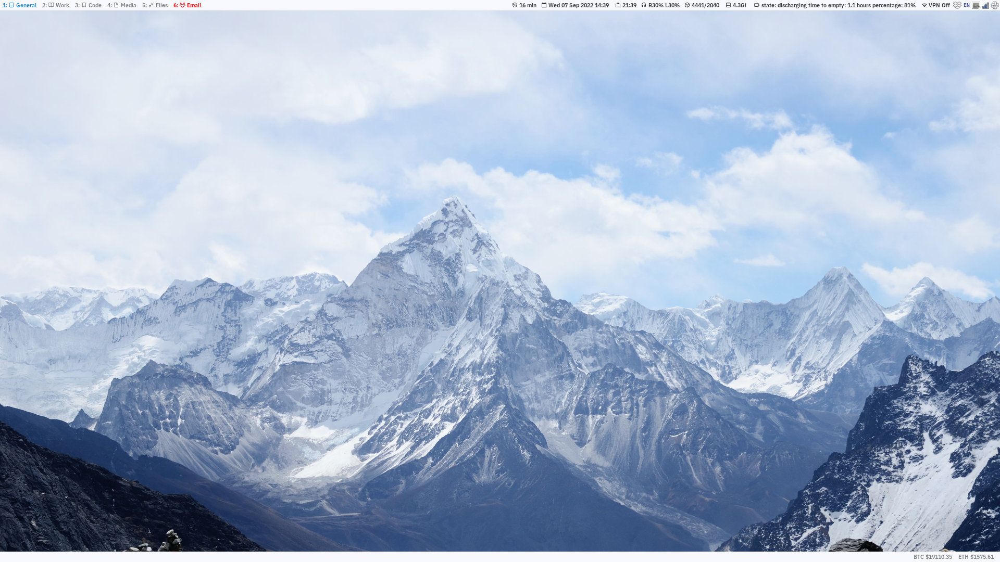
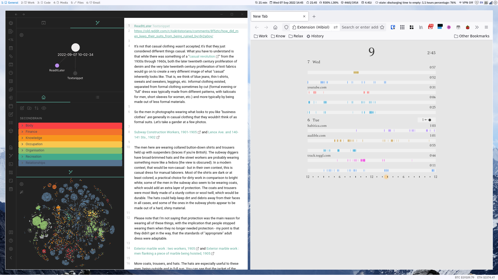

# Blue KaleCream

 

These are the dotfiles for my [i3](https://i3wm.org/docs/) on Ubuntu 22.04.1 LTS x86_64.

The top bar & bottom bar are made with [i3status]( https://i3wm.org/i3status/manpage.html). The icons are from [Font Awesome](https://fontawesome.com/).

Top Bar Information
- Uptime
- Local Date & Time
- Secondary Timezone Time
- Volume
- Swap
- RAM
- Battery
- VPN
- System Tray

Bottom Bar Information
- BTC Price
- ETH Price

Programs:
- Notifications: [Dunst](https://dunst-project.org/) |  [My Dunst Config](https://github.com/kalecream/dotfiles/blob/main/dunstrc) → [Linux Notification Center](https://github.com/phuhl/linux_notification_center) | [My LMC config (not yet updated)]()

